# 🛒 Fruit Cart System

A multi-component project that demonstrates a complete fruit cart system with:

1. **Java Backend** → A rule engine to compute fruit prices (calculator style, no storage)
2. **JavaScript API** → Exposes endpoints to manage users, add items to cart, generate bills, and handle authorization
3. **Python Scripts** → Data generation and analysis using Faker and data science libraries

---

---
CODE FLOW

```mermaid
sequenceDiagram
    participant U as 🧑 User / Frontend
    participant JS as 🟨 JavaScript API
    participant DB as 🗄 Database
    participant JBE as 🟦 Java Backend (Fruit Calculator)
    participant PY as 🐍 Python Analytics Tool

%% User adds fruits
    U->>JS: Add fruit to cart (POST /cart/add)
    JS->>DB: Save cart items

%% Checkout process
    U->>JS: Checkout request (GET /cart/bill)
    JS->>DB: Fetch cart items
    JS->>JBE: Send cart items for price calculation
    JBE-->>JS: Return total price with discount rules
    JS->>DB: Save generated bill
    JS-->>U: Return bill details (JSON/HTML)

%% Analytics (async)
    PY->>DB: Read transaction & cart data
    PY-->>PY: Perform analysis (EDA, reports, trends)


```



## 📌 Overview

This system simulates a fruit shopping cart with price computation, billing, and analytics:

- The **Java backend** handles fruit price calculation using discount rules (e.g., Buy-One-Get-One, Three-for-Two, No Discount).
- The **JavaScript API** provides endpoints for creating users, managing carts, and generating bills with proper authentication.
- The **Python scripts** are used to generate dummy data and perform analysis for insights and reporting.

<a name="readme-top"></a>
<br />

<div align="center">

<h3 align="center">Shopping Cart</h3>

  <p align="center">
Shopping Api with Pricing Calculation Engine
    <br />
  </p>

</div>

<!-- TABLE OF CONTENTS -->

<details>
  <summary>Table of Contents</summary>
  <ol>
    <li>
      <a href="#about-the-project">About The Project</a>
      <ul>
        <li><a href="#built-with">Built With</a></li>
      </ul>
    </li>
    <li>
      <a href="#getting-started">Getting Started</a>
      <ul>
        <li><a href="#prerequisites">Prerequisites</a></li>
        <li><a href="#installation">Installation</a></li>
      </ul>
    </li>
    <li><a href="#usage">Usage</a></li>
    <li><a href="#roadmap">Roadmap</a></li>
    <li><a href="#contributing">Contributing</a></li>
    <li><a href="#license">License</a></li>
    <li><a href="#contact">Contact</a></li>
    <li><a href="#acknowledgments">Acknowledgments</a></li>
  </ol>
</details>


<!-- ABOUT THE PROJECT -->

## About The Project

Sample Shopping cart Project integrated with Java Pricing calcuation engine using gRPC interface


<p align="right">(<a href="#readme-top">back to top</a>)</p>

### Built With

* [![Java][Java]][Java-url]
* [![Node.js][Node.js]][Nodejs-url]
* [![Python][Python]][Python-url]
* [![gRPC][gRPC]][gRPC-url]

<p align="right">(<a href="#readme-top">back to top</a>)</p>

## Process Flow


<!-- GETTING STARTED -->

## Getting Started

To get a local copy up and running follow these simple steps.

### Project Structure

```text
Repository/
├── price_engine/     # Java Project
├── shopping_cart/    # Node.js API
├── db/               # Db location - Shared with Nodejs & Python
└── reporting/        # Python Reporting Program
```

### Prerequisites & Dependencies

This is an example of how to list things you need to use the software and how to install them.
* OpenJdk v17
* Nodejs v22
* Python v3.10+
## Running the Application

```bash
java -jar .\cart-1.0-SNAPSHOT.jar
```

gRPC server will be running on port 50051

### Step 2 -  Run Nodejs Api

open terminal and Navigate to `shoppint_cart` directory

Download Depdencies for first time.

```bash
npm install
```

```bash
npm start
```

Node `server.js` will be running on port 3000

### Step 3 - Post Order


<p align="right">(<a href="#readme-top">back to top</a>)</p>


## Versions

* 0.1 - Release - Version

##Suggested Improvement

1. For availability we can use multiple pods,or instances (since our rule engine is lightweight we could use a cloud function/
 or a lambda function)
2. Use grcp for faster response and data validation
3. To reduce load on db use non relational, and later migrate data to SQL for analytics


