```mermaid
sequenceDiagram
    participant U as 🧑 User / Frontend
    participant JS as 🟨 JavaScript API
    participant DB as 🗄 Database
    participant JBE as 🟦 Java Backend (Fruit Calculator)
    participant PY as 🐍 Python Analytics Tool

%% User adds fruits
    U->>JS: Add fruit to cart (POST /cart/add)
    JS->>DB: Save cart items

%% Checkout process
    U->>JS: Checkout request (GET /cart/bill)
    JS->>DB: Fetch cart items
    JS->>JBE: Send cart items for price calculation
    JBE-->>JS: Return total price with discount rules
    JS->>DB: Save generated bill
    JS-->>U: Return bill details (JSON/HTML)

%% Analytics (async)
    PY->>DB: Read transaction & cart data
    PY-->>PY: Perform analysis (EDA, reports, trends)


```

<a name="readme-top"></a>
<br />

<div align="center">
<h3 align="center">Shopping Cart</h3>

  <p align="center">
Shopping Api with Pricing Calculation Engine
    <br />
  </p>

</div>

<!-- TABLE OF CONTENTS -->

<details>
  <summary>Table of Contents</summary>
  <ol>
    <li>
      <a href="#about-the-project">About The Project</a>
      <ul>
        <li><a href="#built-with">Built With</a></li>
      </ul>
    </li>
    <li>
      <a href="#getting-started">Getting Started</a>
      <ul>
        <li><a href="#prerequisites">Prerequisites</a></li>
        <li><a href="#installation">Installation</a></li>
      </ul>
    </li>
    <li><a href="#usage">Usage</a></li>
    <li><a href="#roadmap">Roadmap</a></li>
    <li><a href="#contributing">Contributing</a></li>
    <li><a href="#license">License</a></li>
    <li><a href="#contact">Contact</a></li>
    <li><a href="#acknowledgments">Acknowledgments</a></li>
  </ol>
</details>


<!-- ABOUT THE PROJECT -->

## About The Project

Sample Shopping cart Project integrated with Java Pricing calcuation engine 

<p align="right">(<a href="#readme-top">back to top</a>)</p>

### Built With

* [![Java][Java]][Java-url]
* [![Node.js][Node.js]][Nodejs-url]
* [![Python][Python]][Python-url]
* [![gRPC][gRPC]][gRPC-url] (Good to be Implemented)

<p align="right">(<a href="#readme-top">back to top</a>)</p>

## Developed Process Flow




## Recommended Process Flow 

### Add Cart


### PlaceOrder


<!-- GETTING STARTED -->

## Getting Started

To get a local copy up and running follow these simple steps.

### Project Structure

```text
Repository/
├── price_engine/     # Java Project
├── shopping_cart/    # Node.js API
├── db/               # Db location - Shared with Nodejs & Python
└── reporting/        # Python Reporting Program
```

### Prerequisites & Dependencies

This is an example of how to list things you need to use the software and how to install them.
* OpenJdk v17
* Nodejs v22
* Python v3.10+
## Running the Java Application

```bash
java -jar .\shopping-cart-api-0.0.1-SNAPSHOT.jar
```

Server will run on PORT 8080

### Run Nodejs Api

open terminal and Navigate to `shoppint_cart` directory

Download Depdencies for first time.

```bash
npm install
```

```bash
npm start
```

Node `app.js` will be running on port 3007

### Step 3 - API 


You can explore the API docs here:

👉 [Swagger UI](https://editor-next.swagger.io/?_gl=1*isw2o1*_gcl_au*MTQ4NDY1NDkyNS4xNzU1NTI2OTM1)


## OpenAPI Spec

``` YAM
openapi: 3.0.0
info:
  title: Shopping Cart API
  version: 1.0.0
  description: API documentation for Shopping Cart service.
servers:
  - url: http://localhost:3007/api/v1
paths:
  /auth/login:
    post:
      summary: User login
      description: Authenticates a user and returns a JWT token.
      requestBody:
        required: true
        content:
          application/json:
            schema:
              type: object
              required:
                - email
                - password
              properties:
                email:
                  type: string
                  format: email
                  example: priya.lorha@gmail.com
                password:
                  type: string
                  format: password
                  example: user@123
      responses:
        "200":
          description: Successful login
          content:
            application/json:
              schema:
                type: object
                properties:
                  success:
                    type: boolean
                    example: true
                  token:
                    type: string
                    example: >-
                      eyJhbGciOiJIUzI1NiIsInR5cCI6IkpXVCJ9...
                  user:
                    type: object
                    properties:
                      id:
                        type: integer
                        example: 1
                      name:
                        type: string
                        example: Priya Lorha
                      email:
                        type: string
                        example: priya.lorha@gmail.com
                      role:
                        type: string
                        example: customer
        "401":
          description: Invalid credentials
  /auth/me:
    get:
      summary: Get logged-in user
      description: Returns the details of the currently authenticated user.
      security:
        - bearerAuth: []
      responses:
        "200":
          description: User details
          content:
            application/json:
              schema:
                type: object
                properties:
                  id:
                    type: integer
                    example: 1
                  name:
                    type: string
                    example: Priya Lorha
                  email:
                    type: string
                    example: priya.lorha@gmail.com
                  role:
                    type: string
                    example: customer
                  createdAt:
                    type: string
                    format: date-time
                  updatedAt:
                    type: string
                    format: date-time
        "401":
          description: Unauthorized
  /cart/:
    post:
      summary: Create a new cart
      description: Creates a new shopping cart for the logged-in user. If the user already has an active cart, the existing cart ID is returned instead.
      tags:
        - Cart
      security:
        - bearerAuth: []
        - cookieAuth: []
      responses:
        "201":
          description: Cart created successfully
          content:
            application/json:
              schema:
                type: object
                properties:
                  createdAt:
                    type: string
                    format: date-time
                  updatedAt:
                    type: string
                    format: date-time
                  id:
                    type: integer
                  userId:
                    type: integer
                  status:
                    type: string
                    example: OPEN
                  total:
                    type: number
                  quantity:
                    type: integer
        "409":
          description: User already has an active cart
          content:
            application/json:
              schema:
                type: object
                properties:
                  message:
                    type: string
                  cartId:
                    type: integer
        "401":
          description: Unauthorized - Invalid or missing token
  /cart/{cartId}/items:
    post:
      summary: Add items to cart
      description: Adds one or more fruit items into an existing cart.
      tags:
        - Cart
      parameters:
        - name: cartId
          in: path
          required: true
          description: The ID of the cart
          schema:
            type: integer
      security:
        - bearerAuth: []
      requestBody:
        required: true
        content:
          application/json:
            schema:
              type: object
              properties:
                items:
                  type: array
                  items:
                    type: string
                    enum: [apple, banana, lime, melon]
              example:
                items: ["apple", "apple", "banana", "apple"]
      responses:
        "200":
          description: Items added successfully
          content:
            application/json:
              schema:
                type: object
                properties:
                  message:
                    type: string
                  items:
                    type: array
                    items:
                      type: object
                      properties:
                        id:
                          type: integer
                        name:
                          type: string
                        offerType:
                          type: string
                        price:
                          type: number
                        quantity:
                          type: integer
                        avgPrice:
                          type: number
                        charged:
                          type: number
                        userId:
                          type: integer
                        cartId:
                          type: integer
                        createdAt:
                          type: string
                          format: date-time
                        updatedAt:
                          type: string
                          format: date-time
                  cart:
                    type: object
                    properties:
                      id:
                        type: integer
                      total:
                        type: number
                      quantity:
                        type: integer
        "400":
          description: Invalid request
          content:
            application/json:
              schema:
                type: object
                properties:
                  error:
                    type: object
  /cart/{cartId}/generateBill:
    post:
      summary: Generate a bill for a cart
      description: Generates the final bill for the cart, closes the cart, and prevents further changes.
      tags:
        - Cart
      security:
        - bearerAuth: []
      parameters:
        - in: path
          name: cartId
          required: true
          schema:
            type: integer
          description: ID of the cart to bill
      requestBody:
        required: true
        content:
          application/json:
            schema:
              type: object
              properties:
                items:
                  type: array
                  items:
                    type: string
                  example: ["apple", "banana", "apple"]
      responses:
        "200":
          description: Successfully generated bill
          content:
            application/json:
              schema:
                type: object
                properties:
                  items:
                    type: array
                    items:
                      type: object
                      properties:
                        id:
                          type: integer
                        userId:
                          type: integer
                        cartId:
                          type: integer
                        name:
                          type: string
                        price:
                          type: number
                        charged:
                          type: number
                        avgPrice:
                          type: number
                        quantity:
                          type: integer
                        offerType:
                          type: string
                        createdAt:
                          type: string
                          format: date-time
                        updatedAt:
                          type: string
                          format: date-time
                  grand_total:
                    type: number
                  total_quantity:
                    type: integer
        "400":
          description: Cart is empty or invalid request
          content:
            application/json:
              schema:
                type: object
                properties:
                  message:
                    type: string
        "404":
          description: No active cart found
          content:
            application/json:
              schema:
                type: object
                properties:
                  message:
                    type: string

components:
  securitySchemes:
    bearerAuth:
      type: http
      scheme: bearer
      bearerFormat: JWT
    cookieAuth:
      type: apiKey
      in: cookie
      name: token

```


### POSTMAN COLLECTION

[postman collection](https://web.postman.co/workspace/f4dca942-6804-4b83-85b3-10a8cc3db5d3/collection/4640872-f533b1b4-4511-4673-89bf-cca566db9ab6?action=share&source=copy-link&creator=4640872)	


<p align="right">(<a href="#readme-top">back to top</a>)</p>


## Versions

* 0.1 - Release - Version

##Suggested Improvement

1. For availability we can use multiple pods,or instances (since our rule engine is lightweight we could use a cloud function/
 or a lambda function)
2. Use grcp for faster response and data validation
3. To reduce load on db use non relational, and later migrate data to SQL for analytics


